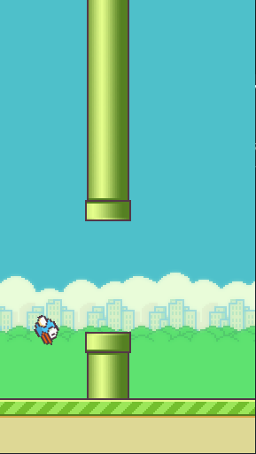

# Flappy-Bird-Pygame 
      
The popular mobile game, Flappy Bird, implemented using python 3 and pygame.

<br>

## Run the game
After installing all the necessary Libraries run the ```flappybird.py``` file located at

    /Flappy-Bird-Pygame/flappybird.py

<br>

## Assets
All assets used to make the game are located at
    
    /Flappy-Bird-Pygame/sprites
    /Flappy-Bird-Pygame/Sounds


<br>

<!-- ## Main Menu -->

<!-- <br> -->

<!--  -->


<!-- <br> -->

<!-- ## Rule Page -->

<!-- <br> -->

<!--  -->

<!-- <br> -->

## Game Screen

<br>

<p align="center">



</p>
<br>

<p align="center">
Made with ❤️ by Sohum Sikdar & Aadit Kant Jha
</p>
